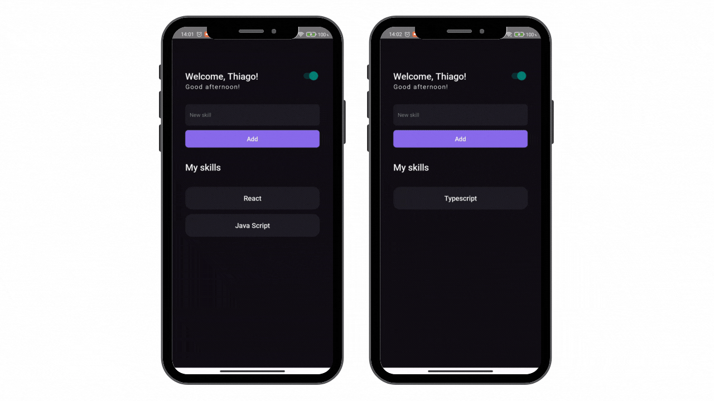

<center>

</center>

<br>

## 📖 Sobre

Aplicativo desenvolvido no módulo de **Fundamentos do React Native** do Ignite da Rocketseat.

## 🧰 Ferramentas

- [React Native CLI](https://reactnative.dev/docs/environment-setup)
- TypeScript

## ⚛️ O que foi utilizado?

- Componentes funcionais;
- Estilização de componentes utilizando com o [Stylesheet](https://reactnative.dev/docs/stylesheet);
- Context API + hooks personalizados;

## 📝 Features

- Cadasrtro e removação de itens;
- Alteração do tema entre claro e escuro;

## 🏁 Como executar?

```shell
git clone https://github.com/thenriquedb/my-skills.git
yarn
yarn android
yarn start
```
